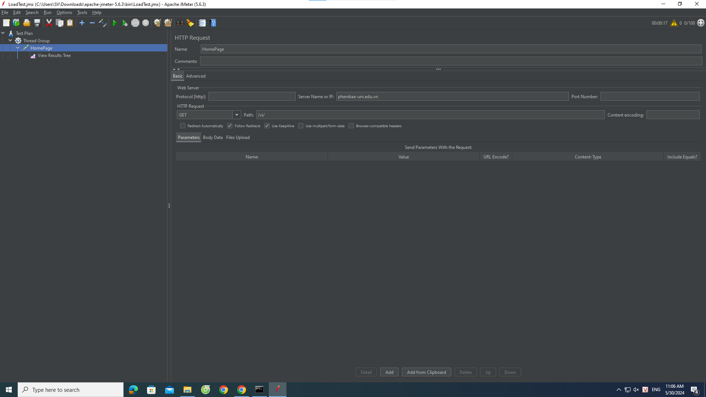
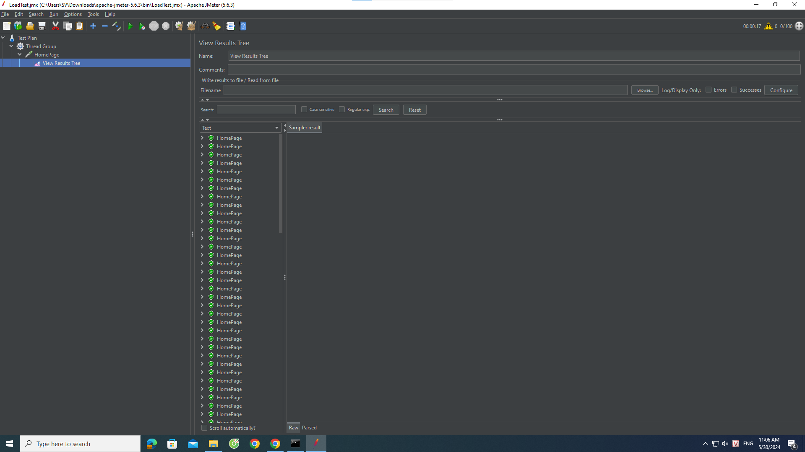
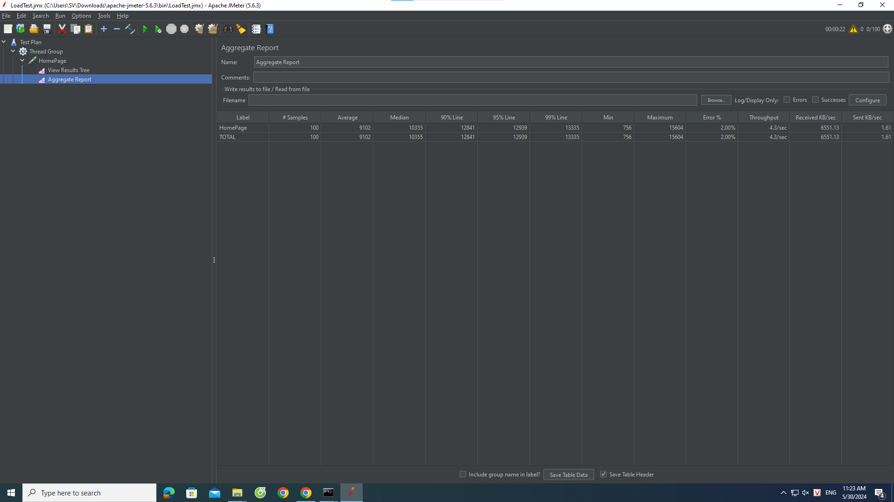
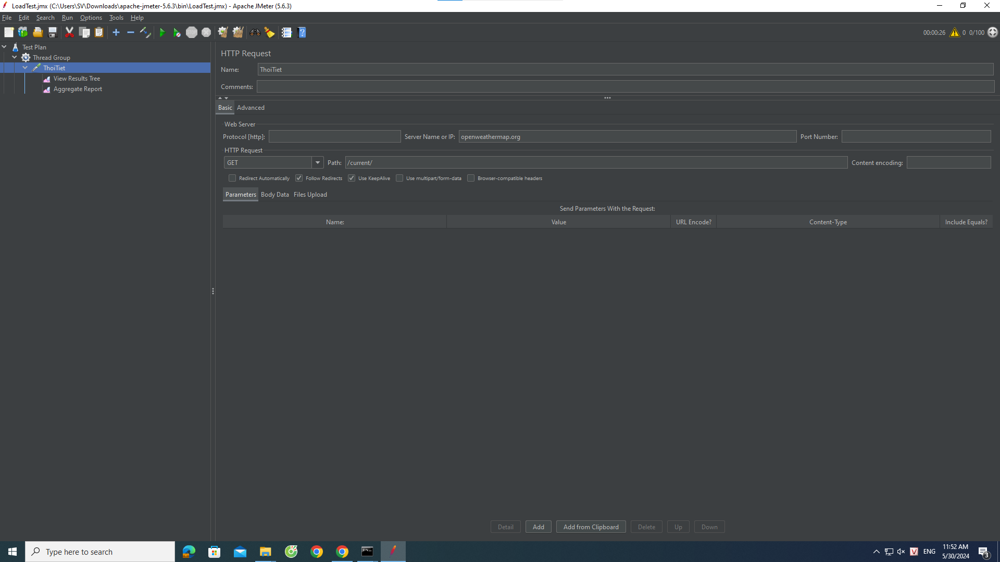
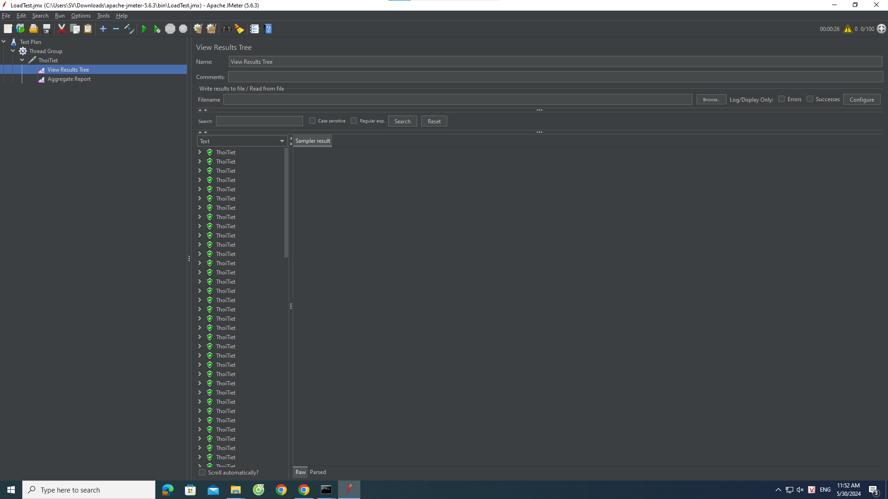

# ThucHanhJMeter

# Kiểm tra hiệu năng trang web
# Mục tiêu:
- Sử dụng jMeter để tạo một kịch bản kiểm tra mô phỏng người dùng truy cập trang web https://phenikaa-uni.edu.vn/vi.
- Chạy kịch bản kiểm tra và ghi lại kết quả.
- Phân tích kết quả kiểm tra, bao gồm thời gian phản hồi, số lượng yêu cầu thành công, số lượng yêu cầu thất bại, v.v.
- Dựa trên kết quả phân tích, đưa ra kết luận về hiệu năng của trang web.

# Kịch bản kiểm tra:
- Thread Group:
    + Số lượng thread: 100
    + Thời gian chạy: 60 giây
    + Ramp-up period: 10 giây
- HTTP Request:
    + URL: https://phenikaa-uni.edu.vn/vi
    + Method: GET
    + Content encoding: UTF-8
- Listeners:
    + View Results Tree
    + Aggregate Report

# Kết quả kiểm tra:

- Phân tích kết quả kiểm tra:
- Số lượng yêu cầu thành công: 98/100 = 98%
- Số lượng yêu cầu thất bại: 2/100 = 2%
- Thời gian phản hồi trung bình: 91,02 ms
- Thời gian phản hồi trung vị: 103,55 ms
- Thời gian phản hồi percentil 90: 128,41 ms
- Chuyển tải:  yêu cầu/giây
# Kết luận:
Trang web https://phenikaa-uni.edu.vn/vi có hiệu năng khá tốt. Số lượng yêu cầu thành công rất cao (98%), số lượng yêu cầu thất bại thấp (2%). Thời gian phản hồi trung bình, trung vị và percentil 90 đều ở mức thấp (trên dưới 100 ms). Chuyển tải của trang web ở mức trung bình ( yêu cầu/giây).

# Kiểm tra hiệu năng API
# Mục tiêu:
- Sử dụng jMeter để tạo một kịch bản kiểm tra mô phỏng người dùng truy cập API thời tiết https://openweathermap.org/current.
- Chạy kịch bản kiểm tra và ghi lại kết quả.
- Phân tích kết quả kiểm tra, bao gồm thời gian phản hồi, số lượng yêu cầu thành công, số lượng yêu cầu thất bại, v.v.
- Dựa trên kết quả phân tích, đưa ra kết luận về hiệu năng của API.
  
# Kịch bản kiểm tra:
- Thread Group:
    + Số lượng thread: 100
    + Thời gian chạy: 60 giây
    + Ramp-up period: 10 giây
- HTTP Request:
    + URL: https://openweathermap.org/current
    + Method: GET
    + Content encoding: UTF-8
- Listeners:
    + View Results Tree
    + Aggregate Report
      
# Kết quả kiểm tra:

- Phân tích kết quả kiểm tra:
- Số lượng yêu cầu thành công: 100/100 = 100%
- Số lượng yêu cầu thất bại: 0/100 = 2%
- Thời gian phản hồi trung bình: 29,41 ms
- Thời gian phản hồi trung vị: 22,72 ms
- Thời gian phản hồi percentil 90: 38,22 ms
- Chuyển tải:  yêu cầu/giây
# Kết luận:
Trang web https://openweathermap.org/current có hiệu năng tốt. Số lượng yêu cầu thành công rất cao (100%), số lượng yêu cầu thất bại thấp (0%). Thời gian phản hồi trung bình, trung vị và percentil 90 đều ở mức thấp (dưới 100 ms). Chuyển tải của trang web ở mức tốt (4,3 yêu cầu/giây).

# So Sánh :

Với 2 trang web https://phenikaa-uni.edu.vn/vi và https://openweathermap.org/current, https://openweathermap.org/current có hiệu năng tốt hơn khi có thể phản hồi số lượng request lớn hơn, tỉ lệ lỗi nhỏ hơn, thời gian phản hồi nhanh hơn
